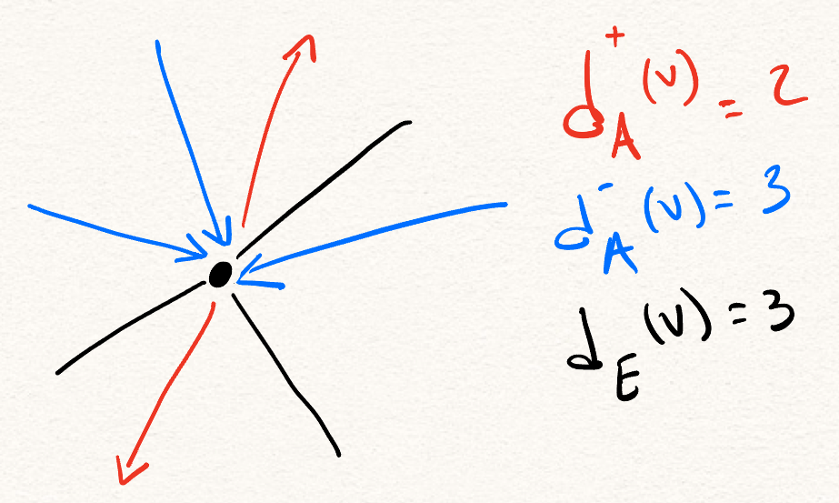
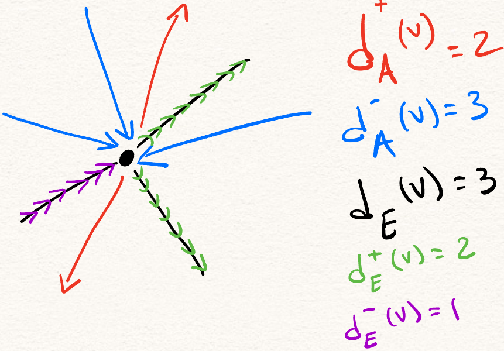

# Enunciado

Un _grafo mixto_ es una tripla $G = (V, E, A)$ tal que $(V, E)$ es un grafo, $(V, A)$ es un grafo orientado, y $E$ y $A$ no tienen aristas en común, cuando las aristas de $A$ son consideradas sin dirección. En otras palabras, G se obtiene del grafo $(V, E \cup A)$ orientando las aristas de $A$. El grafo mixto $G$ es _euleriano_ si se pueden orientar las aristas de $E$ a fin de que el grafo orientado resultante tenga un circuito que pase por todas sus aristas exactamente una vez.

Es sabido que un digrafo es euleriano si y sólo si el digrafo es conexo y $d^+(v) = d^-(v)$ para todo $v \in V(G)$.

* Modelar el problema de decidir si un grafo mixto es euleriano como un problema de flujo.
* Dar una interpretación a cada unidad de flujo y cada restricción de capacidad. 
* Demostrar que el modelo es correcto. 
* Determinar la complejidad de resolver el modelo resultante con el algoritmo de Edmonds y Karp.

## Resolución

### Modelado

Vamos a establecer un poco de notación para que sea más fácil hablar de los objetos que vamos a usar. Para todo $v \in V$, llamemos:

* $d_E(v)$ al número de aristas no-dirigidas incidentes a $v$ en $E$,
* $d^{+}_A(v)$ al número de aristas dirigidas en $A$ que salen de $v$,
* $d^{-}_A(v)$ al número de aristas dirigidas en $A$ que entran a $v$.
* $d^{+}_E(v)$ al número de aristas no-dirigidas en $E$, que orientamos como saliendo de $v$.
* $d^{-}_E(v)$ al número de aristas no-dirigidas en $E$, que orientamos como entrando a $v$.

Nuestro objetivo es darle una orientación a todas las aristas de $E$, tal que para todo $v \in V$, tengamos que su grado de entrada es idéntico a su grado de salida. Es decir, que $d^{-}_E(v) + d^{-}_A(v) = d^{+}_E(v) + d^{+}_A(v)$. Vamos a ignorar la condición de verificar que sea conexo (débilmente o fuertemente, es lo mismo para grafos dirigidos eulerianos), porque es sencilla, y no involucra el modelado del problema como flujo.

Veamos un ejemplo. Para este vértice $v \in V$, tenemos en $E$ tres aristas incidentes, y en $A$ cinco.

Queremos orientar las tres aristas en $E$, de tal forma que nos quede el mismo grado de entrada y salida resultante. Por ejemplo, podemos orientarlas de esta manera:

Sabemos que para todo $v \in V$, tenemos $d_E(v) = d^{-}_E(v) + d^{+}_E(v)$, porque estamos orientando todas las aristas en $E$, y luego para cada arista incidente a $v$ o la orientamos saliendo de $v$, o entrando a $v$. Tenemos, entonces, dos ecuaciones para $d^{+}_E(v)$. Igualando estas cantidades, nuestro objetivo es lógicamente equivalente a pedir que para todo $v \in V$:
$$
\begin{align}
d_E(v) - d^{-}_E(v) &= d^{-}_E(v) + d^{-}_A(v) - d^{+}_A(v)\\
\iff d^{-}_E(v) &= \frac{d_E(v) - d^{-}_A(v) + d^{+}_A(v)}{2}
\end{align}
$$
Recordando que $d^{-}_E(v)$ es el número de aristas que orientamos como entrando de $v$. Queremos tomar, entonces, una decisión binaria para cada arista $e = \{u, v\} \in E$: O la oriento como entrando a $u$, o la oriento como entrando a $v$. Esto nos motiva a un algoritmo basado en flujo, donde para cada arista $e \in E$, mandamos una unidad de flujo, y esa unidad puede fluir o bien hacia $u$, o bien hacia $v$, pero no hacia ambas. La elección que tome esa unidad de flujo nos va a decir hacia dónde orientamos la arista $e$. Mientras tanto, queremos que el máximo flujo que entra hacia $v$ sea exactamente la expresión que vimos arriba para $d^{-}_E(v)$. Si logramos obtener un flujo que mande esa cantidad de unidades hacia $v$, y es valga para todo $v \in V$, entonces vamos a obtener una orientación de todas las aristas, de tal forma que el grafo dirigido resultante es euleriano. Eso lo vamos a demostrar formalmente.

Consideremos, entonces, la siguiente red de flujo $R = (W, F, c$), con:

* $W = \{s\} \cup E \cup V \cup \{t\}$
* $F = \{(s, e) \mid e \in E\}\ \cup \{(e, v) \mid e \in E, v \in e\} \cup \{(v, t) \mid v \in V\}$
* $c((a, b)) = \begin{cases}1&\text{ si } a = s\\1&\text{ si } a \in E\\\frac{d_E(a) - d^{-}_A(a) + d^{+}_A(a)}{2}&\text{ si } b = t\end{cases}$.

El problma de encontrar una orientación a las aristas de $E$ se resuelve corriendo un algoritmo de flujo máximo en $R$, desde $s$ hasta $t$. Obviamente no hay un flujo con valor mayor a $|E|$, dado que salen $|E|$ aristas de capacidad $1$ de $s$. Si el flujo máximo tiene un valor de $|E|$, entonces existe una orientación como la pedida, y es orientar $e = \{u, v\}$ hacia $v$ si $c((e, v)) = 1$, y hacia $u$ si $c((e, u)) = 1$. Si el flujo máximo tiene un valor menor a $|E|$, entonces no es posible orientar las aristas de forma de conseguir un grafo dirigido euleriano.

Una unidad de flujo es una decisión sobre cómo orientar una arista. Las restricciones de capacidad indican que cada arista se puede orientar una vez, que cada arista se puede orientar como saliendo de exactamente uno de sus extremos, y que queremos que las aristas que salen de cada vértice sean igual en número a las aristas que entran a ese vértice.

### Demostración

$\Rightarrow)$. Queremos ver que si hay un flujo de valor $|E|$, y es conexo, entonces existe una orientación de $E$ que resulte en un grafo euleriano. Un flujo máximo de valor $|E|$ implica que cada arista que sale de $s$ está saturada, porque hay $|E|$ de ellas, y cada una tiene capacidad $1$. Veamos que también implica que cada arista que llega a $t$ está saturada. La suma de las capacidades de las aristas que entran a $t$ es
$$
\begin{align}
\sum_{v\in V} \frac{d_E(v) - d^+_A(v) + d^-_A(v)}{2} &= \frac{1}{2}\left(\sum_{v\in V} d_E(v)\right) + \frac{1}{2}\left(\sum_{v\in V}  d^-_A(v) - \sum_{v\in V} d^+_A(v)\right)\\
&= \frac{1}{2} \cdot 2|E| + \frac{1}{2} \cdot 0\\
&= |E|
\end{align}
$$
El primer término es $|E|$ porque al sumar $d_E(v)$ para todo $v \in V$, contamos a cada $e \in E$ dos veces. El segundo término es cero porque cada arista aporta 1 a un grado de salida y a un grado de entrada, y luego la suma del grado de entrada de todos los vértices es igual a la suma del grado de salida de todos los vértices.
Luego, sabemos que si el flujo tiene valor $|E|$, todas las aristas que entran a $t$ están saturadas, y luego para cada vértice $v \in V$, el flujo que le llega es $\frac{d_E(v) - d^{-}_A(v) + d^{+}_A(v)}{2}$, porque esa es la capacidad de la arista $(v, t)$. Recordemos que el flujo que le entra a $v$ es el número de aristas de $E$ que orientamos como entrando a $v$, es decir, $d^{-}_E(v)$. Luego, tenemos que para todo $v$, $d^{-}_E(v) = \frac{d_E(v) - d^{-}_A(v) + d^{+}_A(v)}{2}$. Como vimos, esto es equivalente, usando que $d_E(v) = d^+_E(v) + d^-_E(v)$, a que $d^{-}_E(v) + d^{-}_A(v) = d^{+}_E(v) + d^{+}_A(v)$. Luego, esta orientación de aristas hace que para todo $v \in V$, su grado de entrada y su grado de salida son idénticos.
Asimismo, como las aristas que salen de $s$ están saturadas, a $(s, e)$ le llega una unidad de flujo para cada $e \in E$. Por la condición de conservación de flujo sabemos que sale una unidad de flujo hacia $(e, v)$ para exactamente un $v \in e$, y no dos ni cero. Luego, la arista $e \in E$ está orientada como entrando a ese $v$, y luego orientamos todas las aristas como entrando hacia alguna de sus puntas.
Luego, si $G$ es conexo, tenemos una orientación de todas las aristas en $E$, y esta orientación produce un grafo dirigido euleriano.

$\Leftarrow)$. Queremos ver que si hay una orientación de las aristas en $E$ que produce un grafo dirigido euleriano, entonces hay un flujo en $R$ de valor $|E|$ que da lugar a esa orientación, y es máximo. Para esto, describamos el flujo $f:F \to \mathbb{R}$, y verifiquemos que la condición de flujo se verifica en todos los vértices de $W$.

* $f((s, e)) = 1$, para todo $e \in E$. Esto nos dice que el valor del flujo, si podemos crearlo, va a ser $|E|$, la suma del flujo que sale de la fuente. La condición de flujo para $s$ es sólo que su suma de flujo no sea negativo, y esto es cierto. El flujo es igual a la capacidad, $c((s, e)) = 1$.
* $f((e, u)) = 1$ para todo $e \in E, u \in e$, si y sólo si la arista $e$ está orientada hacia $u$, y $f(e, u) = 0$ de otra forma. A $e$ le llega una unidad de flujo, y como está orientada sólo hacia a uno de sus extremos, sale una unidad de flujo de la misma, y por lo tanto la condición de flujo se verifica en $e$. El flujo es menor o igual a la capacidad, $c((e, u)) = 1$.
* $f((e, t)) = \frac{d_E(v) - d^{-}_A(v) + d^{+}_A(v)}{2}$, para todo $e \in E$. Esto es igual a su capacidad. Tenemos una orientación que hace que $d^{-}_E(v) + d^{-}_A(v) = d^{+}_E(v) + d^{+}_A(v)$ para todo $v \in V$, y como vimos, esto es lo mismo que $d^{-}_E(v) = \frac{d_E(v) - d^{-}_A(v) + d^{+}_A(v)}{2}$. Luego, como en la orientación tengo $d^-_E(v)$ aristas orientadas hacia $v$, y en $R$ (por el item anterior) tengo una unidad de flujo por cada arista en $E$ orientada hacia $v$, la suma del flujo que le llega a $v$ es exactamente $d^-_E(v)$. Como estoy haciendo fluir $f((e, t)) = d^-_E(v)$ desde $e$ a $t$, la condición de flujo se satisface en $e$.

Luego tenemos un flujo en $R$, de valor $|E|$, que da lugar a esa orientación. Obviamente, como la suma de las capacidades de las aristas que salen de $s$ es $|E|$, este flujo es máximo.

Notemos que no necesitamos la condición sobre conectividad de $G$ para esta parte; el flujo realmente sólo nos habla sobre la condición de grados de entrada y salida en cada vértice, y no dice nada sobre la conectividad del grafo original.

### Algoritmo

El algoritmo que vamos a usar es el de Edmonds-Karp. La implementación standard de este algoritmo toma tiempo $O(nm^2)$, al correrse en una red de flujo con $n$ vértices y $m$ aristas. En nuestro caso, $n = |W| = 2 + |E| + |V|$, y $m = |F| = |E| + 2|E| + |V| = 3|E| + |V|$. Luego, correr el algoritmo de flujo toma $(2 + |E| + |V|)(3|E| + |V|)^2$. También tenemos que tener en cuenta el tiempo que toma armar $R$, en particular, calcular $c$ requiere caminar por todas las aristas de $A$ una vez. Los otros costos van a ser menores que el costo de correr el algoritmo de flujo. Luego, el costo temporal asintótico de nuestra solución está en $O(|A| + (2 + |E| + |V|)(3|E| + |V|)^2)$.

